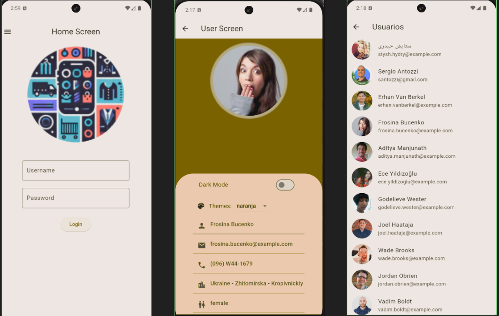
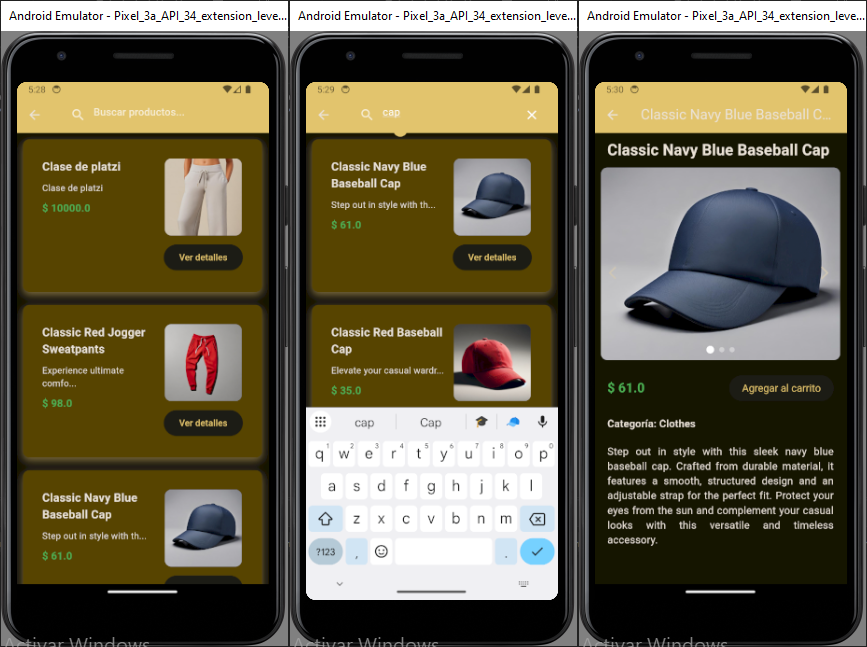

# The Best Buy - carrito de compras

## Integrantes
  * Sergio Antozzi
  * Gianluca Fagherazzi 
  * Leonardo Telez
  * Javier Kinter

## Tabla de Contenidos

- [Descripción](#descripción)
- [Funcionamiento](#funcionamiento)
- [Diagrama](#diagrama)
- [Screens](#screens)
- [Pantallas](#pantallas)
- [CustomWidgets](#customwidgets)
- [Tecnologías](#tecnologías)
- [Instalación](#instalación)
- [Uso](#uso)
- [Contribución](#contribución)

## Descripción

Este proyecto es una aplicación de carrito de compras desarrollada en Flutter utilizando una arquitectura limpia. Su diseño modular asegura que la lógica de negocio, la interfaz de usuario y los datos estén desacoplados, facilitando la escalabilidad, la mantenibilidad y las pruebas unitarias.

## Funcionamiento

Funcionamiento:
Desde la pantalla principal se puede apreciar un buscador y un menú desplegable en el lado izquierdo, si accedemos a ese menú, veremos 5 opciones (Home, Listado de Productos, Listado de Categorías, Login, Carrito).

    Home:
        Regresa al usuario directamente a la pantalla principal (home_screen).

    Listado de Productos:
        Envía al usuario a otra pantalla (products_screen), en donde se muestran un listado de TODOS los productos que están cargados.

    Lista de Categoría:
        Envía al usuario a otra pantalla (categorys_screen), en donde se muestran un listado de TODAS las categorías que están cargadas.

    Login:
        Envía al usuario a otra pantalla (login_screen), en donde el usuario puede iniciar sesión, con los datos que se encuentran guardados.

        -Para entrar como administrados se rellenan ambos campos (user y password) con la palabra "admin".

        -Para entrar como usuario se rellenan ambos campos (user y password) con la palabra "user".

    Lista de Usuario:
        Muestra la lista de usuarios (users_screen), la cual solo la podrá ver el administrador y solo él podrá modificar sus propiedades.

    Carrito:
        Envía al usuario a otra pantalla (carts_screen), en donde se muestran un listado de TODOS los carros de compra que están cargadas.


## Descripción

Este proyecto es una aplicación de carrito de compras desarrollada en Flutter utilizando una arquitectura limpia. Su diseño modular asegura que la lógica de negocio, la interfaz de usuario y los datos estén desacoplados, facilitando la escalabilidad, la mantenibilidad y las pruebas unitarias.

Funcionamiento:
    Desde la pantalla principal se puede apreciar un buscador y un menus desplegable en el lado izquierdo, si accedemos a ese menu depslegable veremos 4 opciones ()

## Diagrama


## Screens
- screens generales:
* HomeScreen

- screens de usuarios:
* UserScreen
* UsersScreen
* LoginScreen
* ProfileScren

- screens de productos:
* ProductScreen
* ProductsScreen

- screens de categorias:
* CategoryScreen
* CategorysScreen

- screens de carrito:
* CartScreen
* CartsScreen

## Pantallas

- Users



- Products



- Categorys

- Carrito


## CustomWidgets

* DrawerMenu
* UserAvatar
* UserCard 
* ProductsCard
* CategorysCard
* CartsCard

## Tecnologías


<!--tech stack icons-->


| Git      | Dart     | Flutter  |
|----------|----------|----------|
|<p align="center"></p>|<p align="center"></p>    |<p align="center"></p>|

  


**Frameworks y librerías** 

Queremos expresar nuestro más sincero agradecimiento a la comunidad de desarrolladores de código abierto por su invaluable trabajo al crear y mantener las librerías que hemos utilizado en este proyecto.

* Flutter
* cupertino_icons: ^1.0.2  
* shared_preferences: ^2.3.2
* provider: ^6.1.2


A todos los colaboradores y creadores de estas librerías: ¡gracias por compartir su conocimiento y contribuir al crecimiento de la comunidad tecnológica!

## Instalación

Pasos para instalar y configurar tu proyecto localmente.

1. **Clonar el repositorio:**

    ```bash
    git clone https://github.com/santozzi/lab4tp2
    ```

2. **Instalar dependencias:**

    ```bash
    cd lab4tp2
    flutter pub get
    ```

3. **Configurar variables de entorno:**

    Copia el archivo `.env.example` a `.env` y edítalo según sea necesario.

## Uso

El proyecto fue realizado y probado en una virtualización del Pixel 8 API 35


## Contribución

Instrucciones para contribuir al proyecto. Puedes incluir cómo hacer un fork del repositorio, cómo enviar pull requests, y normas de contribución.

1. **Haz un fork del repositorio.**
2. **Crea una rama nueva:**

    ```bash
    git checkout -b feature/nueva-caracteristica
    ```

3. **Realiza tus cambios y haz commit:**

    ```bash
    git add .
    git commit -m "Agrega nueva característica"
    ```

4. **Envía un pull request.**


# flutter_application_base

### Proyecto base para construir un prototipo en Flutter

El repo cuenta con un drawer menu para agregar las distintas pantallas para cada integrante del grupo.


### screens
 1. Se dejan pantallas de ejemplo como custom list, custom item list (Borrar)
 2. Perfil de usuario para dar funcionalidad al switch del light/dark mode.(Reutilizar si asi lo prefieren)

### themes
Se deja estilo demo para el dark mode. Borrar o cambiar según las preferencias del grupo.

### mocks
En esta carpeta se almacenan los mocks con los que funciona la lista custom (Borrar)

### helpers
Se deja clase demo para manejar todos los valores que se almacenarán en las Shared Preferences. De momento solo se utiliza el darkMode

### widgets
Se deja drawer menú básico para la funcionalidad del repo. Cambiar diseño según las preferencias del grupo
